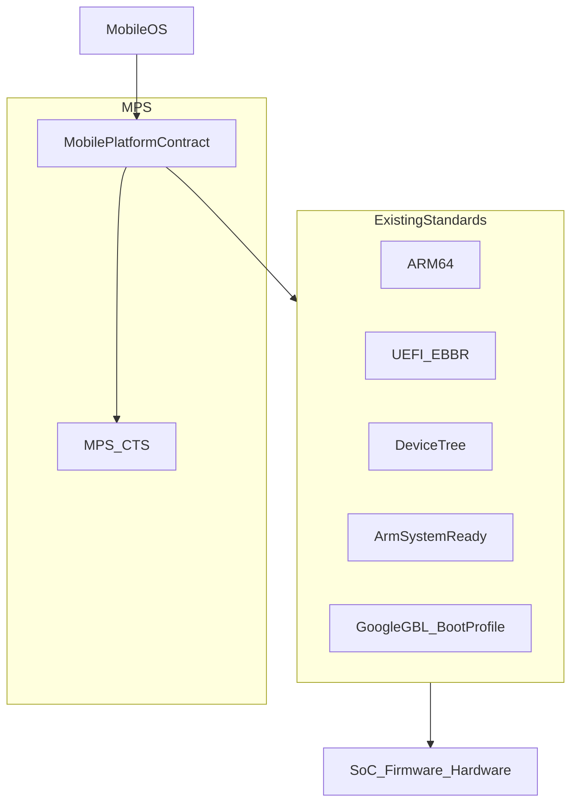
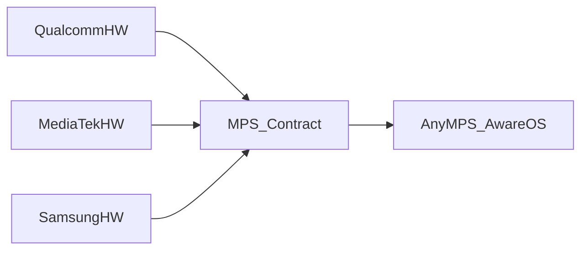
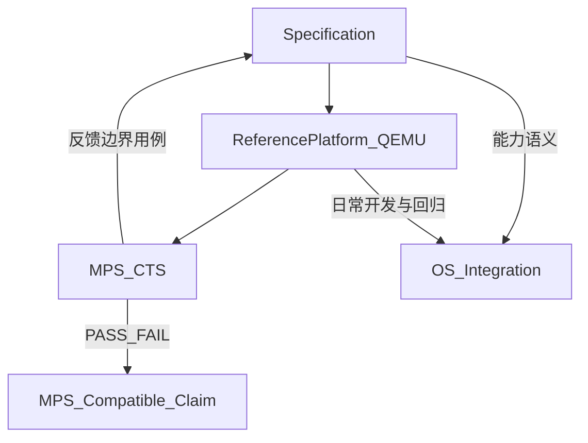
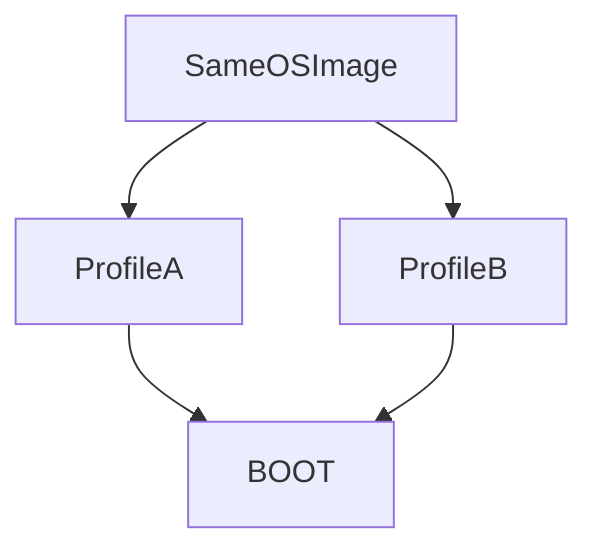
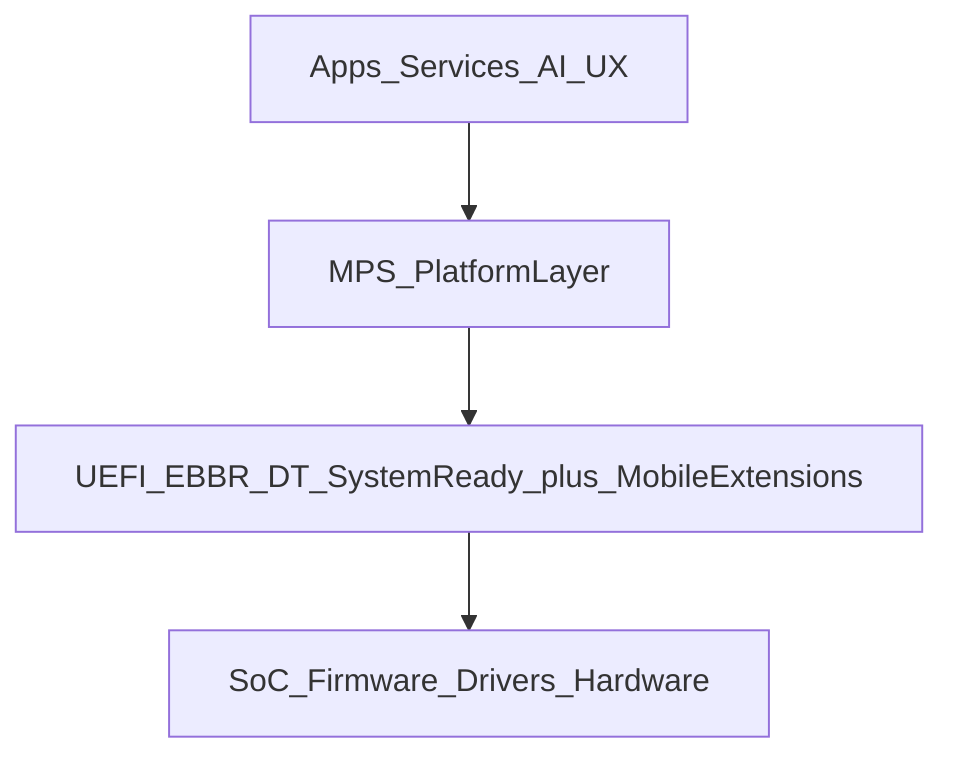
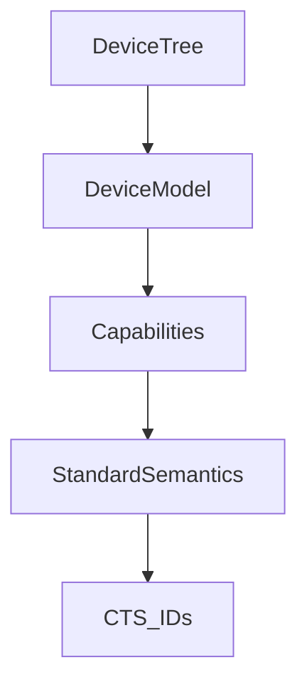
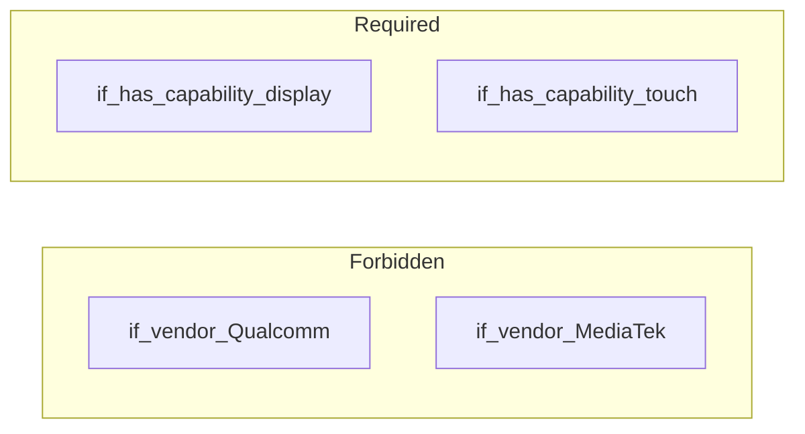
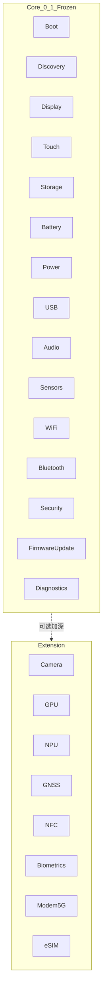
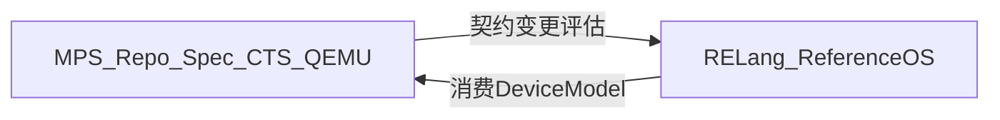

# 深入浅出：MPS —— 让手机 OS 也能「一次适配，多机运行」

> **Mobile Platform Standard（MPS）** 是一套开放的手机计算平台标准。  
> 一句话目标：**让开发新手机 OS，像开发 PC OS 一样简单。**

本文面向 OS / 固件 / SoC 工程师，以及想搞清楚「为什么新手机 OS 这么难做」的技术读者。读完你应能回答三件事：

1. MPS 解决的是哪一层问题（不是 UI，不是应用商店）  
2. Spec / 参考平台 / CTS 如何构成可验收闭环  
3. OS 该如何消费 Device Model，而不是按厂商名写分支  

规范与工具以开放标准仓 [ShujianLv/mps](https://github.com/ShujianLv/mps) 为准；Core **0.1 Frozen**。RELang OS 是第一参考 OS（专有软件）；本文刊登于 RELang OS 宣传站，便于伙伴阅读。延伸规范见文末链接。

> **刊登说明**：本文介绍开放标准 **MPS**（Apache-2.0），原文维护于 [mps](https://github.com/ShujianLv/mps) 仓库；此处为 RELang OS 宣传站转载，便于评估伙伴阅读。RELang OS 产品本身为专有软件。

---

## 1. 先说痛点：PC 能换系统，手机为什么换不起？

在 PC 世界，装一个陌生的 Linux 发行版往往「能开机、能上网、能出画面」——因为底层已经有相对稳定的平台契约：固件启动路径、硬件描述、驱动模型大致可预期。

手机世界则相反。一款新手机 OS 真正的门槛，常常不是桌面或应用框架，而是整条**板级适配链**：


每一家 SoC、每一款机型都有大量私有实现。结果变成：

**做一个新手机 OS ≈ 为每一款手机重新做一次底层平台适配。**

适配成本把生态锁死：硬件侧不愿为「还没人用的 OS」单独开端口；OS 侧不敢押注「只有一家 SoC 文档能读懂」的路径。市场于是高度封闭。

MPS 的出发点很朴素：把「手机」从高度定制的封闭设备，变成**可共享的 ARM 移动计算平台**——让 Android、Linux、BSD、RELang、研究型 OS、AI OS 等，都能对接同一套硬件侧契约。

---

## 2. MPS 是什么——以及明确不是什么

### 2.1 一句话定义

```text
MPS = SystemReady + UEFI/EBBR + Mobile Extensions + Compliance
```

白话翻译：

| 成分 | 白话 |
|------|------|
| **SystemReady / UEFI / EBBR / Device Tree** | 不另造一套启动与描述宇宙；站在 Arm 与固件主流之上 |
| **Mobile Extensions** | 补齐手机运行时缺的统一语义：显示、触摸、电池、电源、无线…… |
| **Compliance（MPS-CTS）** | 契约必须能机器验收；没有 PASS 就不能自称兼容 |

MPS **不替代** ARM64、UEFI、EBBR、Device Tree、Arm SystemReady、Google GBL。它在其上补齐**移动平台缺失的统一契约**。



### 2.2 不是什么（防范围膨胀）

按项目章程，下列事项**明确不做**：

- 不规定 UI、应用商店或应用 ABI  
- 不替代内核内部驱动模型的全部细节（只规定 OS 可见的平台语义）  
- 不强制 Qualcomm / MediaTek / Samsung 内部实现相同  
- 不做「第二个 Android HAL」——不绑定 Java / AIDL 运行时  
- GBL 是 Android 的重要 Boot Profile，**不是** MPS 本身；MPS 与之协同、不吞并  

一句话：**契约，不是克隆。**



OS 不判断「这是哪家的芯片」，只发现「这台设备有没有显示、触摸、电池、存储……以及它们的标准语义是什么」。

---

## 3. 完整三角：能写、能跑、能测

任何「开放平台标准」如果只有 PDF，最后都会变成宣传册。MPS 强制三条腿一起走：

| 支柱 | 目录 | 作用 |
|------|------|------|
| **Specification** | [`spec/`](https://github.com/ShujianLv/mps/tree/main/spec) | Core / Extension 能力契约 |
| **Reference Platform** | [`refplatform/`](https://github.com/ShujianLv/mps/tree/main/refplatform) | QEMU 上的参考「MPS 手机」 |
| **MPS-CTS** | [`cts/`](https://github.com/ShujianLv/mps/tree/main/cts) | 合规测试，PASS / FAIL |



- **真机**是认证目标；  
- **QEMU 参考手机**是日常开发与回归的默认宿主——规范与 CTS 不依赖真机即可闭环。  

只有通过对应版本 **MPS-CTS** 的设备，才能声明 **MPS Compatible**。

---

## 4. 核心验收：同一 OS Image，多台「MPS 手机」

MPS 最硬的成功标准可以用一张图概括：



**同一个 OS Image，不修改核心 OS，即可运行在不同 MPS Device Model / SoC Profile 上。**

这正是 PC 世界习以为常、手机世界长期缺失的那一层。参考平台提供多 Profile（如 `profile-a` / `profile-b`），CTS 与参考 OS 联调路径都围绕这条验收线展开。

---

## 5. 分层架构：MPS 夹在哪里？

从上到下看整机软件栈：



| 层 | 职责 |
|----|------|
| Apps & Services | UI、应用、AI、安全策略——**MPS 不管** |
| **MPS Platform Layer** | Boot、Display、Touch、Storage、Power、Battery、Audio、Sensors、USB、Wi-Fi、Bluetooth、Security、Firmware Update、Diagnostics…… |
| Existing Standards + Extensions | 启动与硬件描述底座 + 移动域扩展 |
| SoC / Firmware / Drivers | 厂商内部实现，可完全不同 |

对 OS 集成方而言：你对接的是 **Platform Layer 的发现与语义**，而不是某一份私有 BSP 手册的偶然结构。

Boot 与 Runtime 还可进一步看成两类 Profile：

- **Boot Profile**：启动与 recovery 路径上的契约（与 UEFI / EBBR / GBL 协同）  
- **Runtime Profile**：OS 运行期可见的 Device Model 与能力语义  

详见 [`docs/profiles/`](https://github.com/ShujianLv/mps/tree/main/docs/profiles)。

---

## 6. Device Model：OS 如何「看见」一台手机

### 6.1 发现流水线

MPS 要求能力可被**发现**、可被**版本协商**、可被**测试**——而不是写死在 OS 源码的 `#ifdef VENDOR` 里。



1. 固件 / 引导加载器暴露 Device Tree（含 MPS 相关节点，见 [`bindings/dt/`](https://github.com/ShujianLv/mps/tree/main/bindings/dt)）  
2. OS 解析 DT，构建 Device Model  
3. 运行时查询 capabilities（参考工具：`mpsctl describe`）  

机器可读能力描述遵循 schema：[`spec/schemas/capabilities.schema.json`](https://github.com/ShujianLv/mps/blob/main/spec/schemas/capabilities.schema.json)；参考实例在 [`refplatform/images/`](https://github.com/ShujianLv/mps/tree/main/refplatform/images)。

最小字段直觉：

| 字段 | 含义 |
|------|------|
| `mps_version` | 声明兼容的 MPS Core 版本 |
| `profile_id` | 设备 Profile 标识 |
| `capabilities` | 能力对象映射（boot、display、…） |

### 6.2 禁止模式 vs 要求模式



- **禁止**：按 SoC 厂商名分支业务逻辑  
- **要求**：按能力有无与版本协商行为  

厂商无关、可枚举、可测试、可扩展——这四条是 Device Model 的原则。Core 保持稳定；差异化能力走 Extension，独立演进。

---

## 7. 能力地图：Core 0.1 与 Extension

### 7.1 Core（必须，0.1 Frozen）

下列能力构成声明 **MPS Compatible — Core 0.1** 的底座（每项有独立规范与 CTS 前缀）：

| 能力 | CTS 前缀（示例） |
|------|------------------|
| Boot / Recovery | `MPS-CTS-BOOT-*` |
| Hardware Discovery | `MPS-CTS-DISC-*` |
| Display | `MPS-CTS-DISP-*` |
| Touch | `MPS-CTS-TOUCH-*` |
| Storage | `MPS-CTS-STOR-*` |
| Battery / Charging | `MPS-CTS-BATT-*` |
| Power / Thermal | `MPS-CTS-PWR-*` |
| USB | `MPS-CTS-USB-*` |
| Audio | `MPS-CTS-AUD-*` |
| Sensors | `MPS-CTS-SENS-*` |
| Wi-Fi | `MPS-CTS-WIFI-*` |
| Bluetooth | `MPS-CTS-BT-*` |
| Security | `MPS-CTS-SEC-*` |
| Firmware Update | `MPS-CTS-FWU-*` |
| Diagnostics | `MPS-CTS-DIAG-*` |

完整索引见 [`spec/core/`](https://github.com/ShujianLv/mps/tree/main/spec/core)。

### 7.2 Extension（可选，后续加深）

相机、GPU、NPU、GNSS、NFC、生物识别、5G Modem、eSIM 等放在 Extension：设备可以声明，也可以省略。CTS 对未声明的 Extension **skip**（带说明的通过），**不**把它们强塞进 Core。



Runtime 语义尽量可映射到 Linux 既有子系统（DRM/KMS、Input、Power Supply、ALSA、nl80211 等），避免再发明第二套驱动宇宙——见 [`docs/interop/linux-mapping.md`](https://github.com/ShujianLv/mps/blob/main/docs/interop/linux-mapping.md)。

---

## 8. CTS 与认证：契约必须能「挂红灯」

没有失败路径的标准，等于没有标准。

MPS-CTS 对每个 Core 能力提供**正例 + 边界**（缺字段、非法枚举、损坏的 JSON 等）。报告 `cts-report.json` 带 harness 版本、`mps_core`、git revision、SBOM 等 provenance 字段，便于公开复现。

```sh
# 在参考能力描述上跑 CTS
cargo run -p mps-cts -- --profile refplatform/images/profile-a

# 校验 + CTS 一键
cargo xtask check
```

宣称兼容的规则很简单：

> **MPS Compatible** = 对应版本 **MPS-CTS PASS** + 可公开复现的报告材料  

自认证流程与徽章措辞见 [`docs/certification/`](https://github.com/ShujianLv/mps/tree/main/docs/certification)。

---

## 9. 与 RELang：标准仓 vs 参考 OS

[MPS 标准仓](https://github.com/ShujianLv/mps) 是**独立开放标准仓**（Apache-2.0）：契约、参考平台、CTS、绑定与文档。

[RELang OS](https://github.com/ShujianLv/RELangOS) 是**第一参考操作系统 / 验证载体**：在 OS 侧实现 MPS 消费端（如 `rhal`），并跑通「同一 Image × 多 MPS Profile」路径。联调剧本在 [`conformance/relang/`](https://github.com/ShujianLv/mps/tree/main/conformance/relang)。



分工清晰：

- MPS：**定义**平台契约与合规  
- 参考 OS：**证明**契约可被真实系统消费  
- 其他 OS：同样可以对齐契约，不必绑定 RELang  

---

## 10. 动手：三分钟摸到闭环

在 [MPS 标准仓](https://github.com/ShujianLv/mps) 根目录：

```sh
# 校验参考设备能力描述
cargo run -p mpsctl -- validate refplatform/images/profile-a/capabilities.json

# 打印 Device Model 摘要
cargo run -p mpsctl -- describe refplatform/images/profile-a/capabilities.json

# 离线 CTS harness
cargo run -p mps-cts -- --profile refplatform/images/profile-a

# 一键：校验 + CTS
cargo xtask check
```

若你代表 OEM / SoC / OS 伙伴，可先读：

- [Why MPS](https://github.com/ShujianLv/mps/blob/main/docs/partners/why-mps.md)  
- [OEM](https://github.com/ShujianLv/mps/blob/main/docs/partners/oem.md) · [SoC](https://github.com/ShujianLv/mps/blob/main/docs/partners/soc.md) · [OS](https://github.com/ShujianLv/mps/blob/main/docs/partners/os.md)  

---

## 11. 结语

MPS 想改变的不是某一款芯片的驱动写法，而是产业协作方式：

| 角色 | 责任 |
|------|------|
| **硬件 / 固件** | 符合 MPS：暴露可发现、可测的能力语义 |
| **操作系统** | 支持 MPS：按能力集成，而不是按厂商名分支 |
| **标准 + CTS** | 把「兼容」从口号变成可复现的 PASS/FAIL |

当同一份 OS Image 能在不同 MPS Profile 上启动，新手机 OS 的门槛才会从「先找齐所有私有文档」降到「对齐一份开放契约」——那才是「像开发 PC OS 一样简单」的真正含义。

---

## 延伸阅读

| 文档 | 内容 |
|------|------|
| [概述](https://github.com/ShujianLv/mps/blob/main/docs/overview/README.md) | Why / How / 标准栈关系 |
| [架构](https://github.com/ShujianLv/mps/blob/main/docs/architecture/README.md) | 分层与 Profile |
| [Device Model](https://github.com/ShujianLv/mps/blob/main/docs/device-model/README.md) | 发现流水线与禁止模式 |
| [规划与路线图](https://github.com/ShujianLv/mps/blob/main/docs/roadmap/README.md) | 行业对标、里程碑、Extension 方向 |
| [认证](https://github.com/ShujianLv/mps/blob/main/docs/certification/README.md) | Compatible 声明与 Freeze |
| [Why MPS（伙伴）](https://github.com/ShujianLv/mps/blob/main/docs/partners/why-mps.md) | 对外沟通摘要 |
| [项目章程](https://github.com/ShujianLv/mps/blob/main/CHARTER.md) | 使命、范围、成功标准 |
| [宣传 PPT](https://github.com/ShujianLv/mps/blob/main/docs/presentations/MPS-全面介绍.pptx) | 演示材料 |
