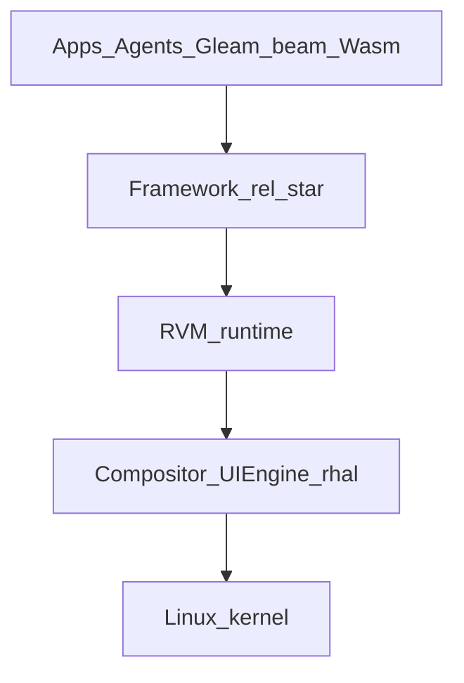
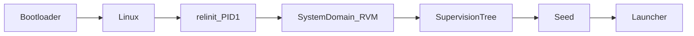
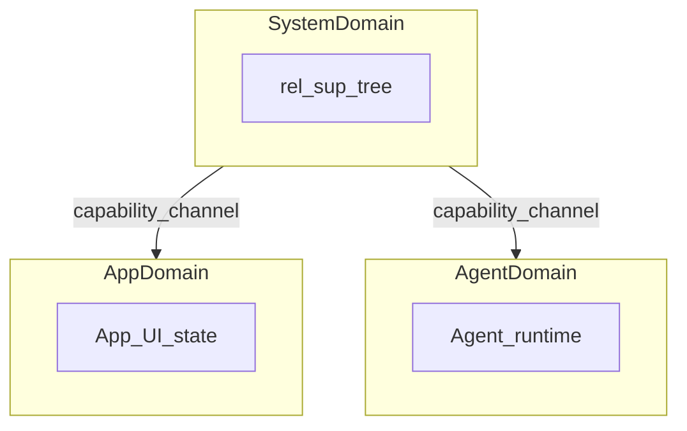
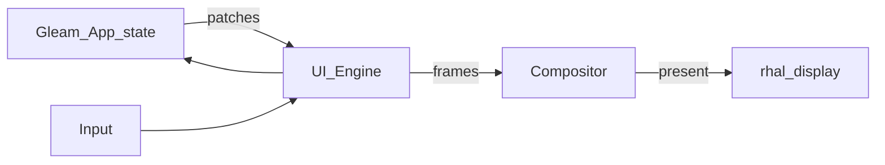
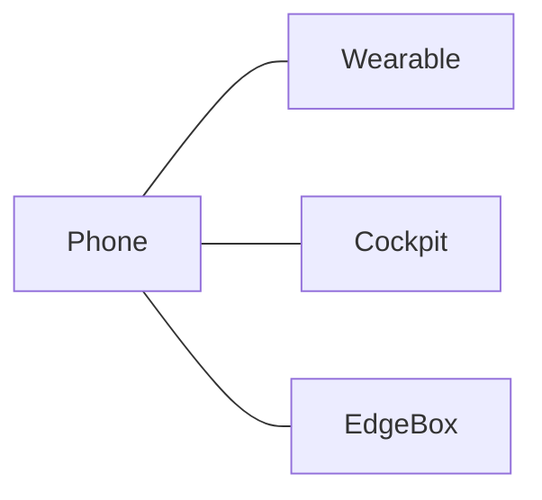
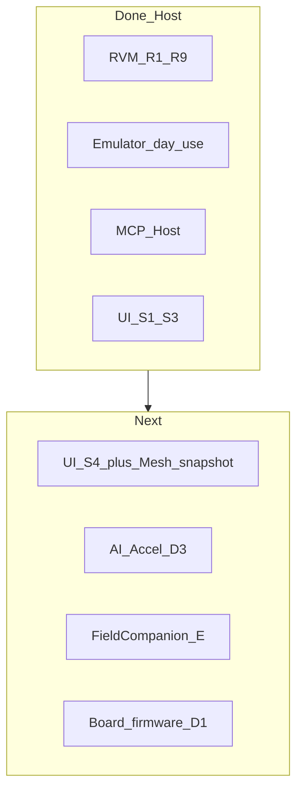

# 深入浅出：RELang OS —— 为代理与多端协同而生的操作系统

> **RELang OS** 是以 Rust 实现的 Erlang/BEAM 运行时（**RVM**）为应用心脏的移动操作系统。  
> **RVM 之于 RELang，如同 ART 之于 Android。**

本文面向 OS / 系统 / 产品架构读者。读完你应能回答五件事：

1. RELang OS 要解决的窗口期是什么（不是「再做一个 Android」）  
2. 从内核到应用，分层各自负责什么  
3. Domain、能力、监督树如何把「代理 / 多端 / 故障」写成系统原语  
4. UI、Mesh、AI、MPS、FieldCompanion 如何挂在同一底座上  
5. 今天 Host/CI 已闭环什么，板级与产品层还缺什么（诚实账本）

完成度对齐内部架构状态账本（workspace **0.3.0** 口径）。  
心脏细读见 [RVM 深入浅出](./rvm-deep-dive.html)；手机平台契约见 [MPS 深入浅出](./mps-deep-dive.html)。

> **刊登说明**：本文介绍专有软件 **RELang OS** 的整机架构。公开宣传站仅作叙事与评估入口；完整源码与内部专篇需经评估授权。配套阅读：[RVM 长文](./rvm-deep-dive.html) · [MPS 长文](./mps-deep-dive.html)。

---

## 1. 一句话与窗口期

### 1.1 一句话

把 Erlang 三十年验证过的 **隔离进程 + 消息传递 + 监督树 + 热升级 + 分布式**，从应用层的库，提升为移动操作系统的第一性原则；用 Rust 保证运行时本身的内存安全与可嵌入性。

### 1.2 为什么是现在？

端侧模型、代理协议（MCP / A2A）、多设备协同与内存安全系统栈同时成熟，而主流手机 OS 仍以「单机 + 人点 App + 粗粒度应用」为默认骨架。  
RELang OS 押注的窗口是：

> 设备正在替人完成任务、跨端接力、在现场持续运行——操作系统必须把**代理、权限与协同**写成原语，而不是后期外挂。

### 1.3 非目标（先画边界）

- 首发不与消费级 Android 全面对打  
- 不追求 100% OTP；兼容的是 **BEAM 字节码与核心语义**  
- 不自研芯片级驱动；前期复用主线 Linux / 厂商 BSP  
- 不自研 Codex；用 MCP / LSP / preview 当外部 AI 工具的后端  

---

## 2. 用一张 Android 对照表建立直觉

| 层次 | Android | RELang OS |
|------|---------|-----------|
| 内核 | Linux | Linux（前期）→ 远期可选 Rust framekernel |
| 应用运行时 | ART | **RVM**（解释 / JIT / AOT） |
| 进程孵化 | Zygote | **Seed**（预热镜像 + fork） |
| IPC | Binder | 域内消息 / 域间通道 |
| 系统服务 | system_server | **系统监督树**（`rel_*`） |
| 应用语言 | Kotlin | **Gleam**（主推）· Elixir · Erlang |
| 原生扩展 | NDK | **Wasm**（默认） |
| 权限 | Manifest + uid | **能力句柄**（不可伪造） |
| UI | Compose / View | 状态在 BEAM，渲染在 Rust |

差异化对外叙事（设计方案 §1.3）按优先级是：

1. AI 代理原生  
2. 多设备即一台机器  
3. 永不重启（监督树 + 热升级）  
4. 结构性安全（Rust + 能力 + 默认无应用原生代码）  
5. 无全局 GC 卡顿（每进程 GC）  

---

## 3. 总体架构：五层蛋糕



| 层 | 做什么 |
|----|--------|
| **应用 / 代理** | Gleam 等编译为 `.beam`；计算密集走 Wasm |
| **框架** | App / Window / Power / Mesh / Agent / Storage… OTP 风格行为 |
| **RVM** | 加载、调度、GC、Seed、Domain 通道、Dist、Wasm 宿主 |
| **原生 Rust** | 合成器、UI Engine、Agent Bridge、HAL（`rhal`） |
| **内核** | 前期主线 Linux（驱动覆盖是头号成本） |

启动链（概念）：



---

## 4. 八条设计原则（操作系统怎么「想」）

1. **一切皆进程，一切皆消息** — 服务、组件、代理、驱动代理统一抽象  
2. **任其崩溃，结构化恢复** — 靠监督树，不靠到处 try/catch  
3. **没有环境权限** — 不能凭名字拿到世界；只能凭被授予的能力句柄  
4. **信任边界分层** — 域内语言隔离；域间才是 OS 安全边界；缺硬件能力时诚实 `not_configured`  
5. **位置透明** — 本地与远端进程同一套消息语义  
6. **确定性优先** — 时间 / 随机 / I/O / 调度可注入、可重放  
7. **能耗是一等公民** — 没有空转与无谓唤醒  
8. **务实复用** — 创新集中在运行时与框架；内核驱动不重复发明  

---

## 5. 心脏：RVM（此处只定位，不展开）

完整 RVM（R1–R9）已在桌面三平台产品口径闭环：解释器 + JIT/AOT、可移植 AsyncIo、Dirty 池、Domain、Seed Zygote、Dist 子集、Wasm WIT、host 电源/生命周期。  

完整 RELang OS = **完整 RVM + `relinit` + framework/HAL + 合成器/UI + 系统服务** —— 后者仍是产品推进主战场。

细节请读 [RVM 深入浅出](./rvm-deep-dive.md)。记住一句即可：

> 嵌入方只依赖门面 crate `rvm`；Linux 专有名（io_uring / cgroup / unshare）是实现细节，不假冒到其它 OS。

---

## 6. Domain 与能力：代理与多端的「宪法」

### 6.1 Domain



- **域内**：BEAM 进程隔离 ≠ 安全边界  
- **域间**：才是信任边界；跨域必须走能力通道  

### 6.2 能力（Capability）

没有「环境权限」：不能因为知道服务名就调用世界。  
工具调用、传感器、网络、跨设备会话——一律是**被授予、可衰减、可审计**的句柄。  
对 AI 代理尤其关键：代理 = 被监督进程，工具 = 消息，权限 = 能力，审计 = 消息追踪。

---

## 7. 系统服务与应用模型

### 7.1 监督树

System Domain 内挂 `rel_*` 服务树：根监督者与子树策略把「谁挂了重启谁」写成结构，而不是运维口诀。  
框架保持 `rel_svc` 路径，不强制整棵树绑死全量 OTP。

### 7.2 应用包与生命周期

- 包格式 **`.rpk`**（验签 / 安装策略；商店公钥未配置时诚实 `store_unconfigured`）  
- 生命周期：启动、前台、后台、冻结（冻结依赖真实 cgroup 能力，失败不装成功）  
- **Intent**：一次性租约，而不是隐式全局总线  

主推应用语言是 **Gleam**（静态类型，扮演 Kotlin 角色）；Elixir / Erlang 仍可进入同一 `.beam` 世界。

---

## 8. UI：状态在 BEAM，像素在 Rust



设计要点：

- 声明式 UI；业务状态住在 Erlang/Gleam 进程  
- 布局 / 文本 / 渲染 / 合成在 Rust（UI Engine + Compositor）  
- Host/CI 已有日用切片：`--with-kernel --serve`、preview 套接字、window mirror、输入 record/replay  
- UI System S1–S3（Desktop / PhoneStack / DesktopFreeform 等）已闭环；S4+（如 TabletSplit、ScreenSnapshot+Mesh 重建）是下一刀  

不要把 Host SoftVsync 120Hz 夹具写成「实机面板已 120Hz」。

---

## 9. 多设备 Mesh：一台逻辑机器

目标形态：手机 / 穿戴 / 座舱 / 边缘终端组成安全的 RVM 协作网——发现、会话、迁移与审计同一套语义。



诚实口径（设计方案实现回写）：

- 宿主接受才扫描 / 拨号 / 证明；否则 `unavailable` / `no_endpoint` / `noconnection`  
- LAN UDP、`path=quic` Host/CI、纯文本 LWW、attest 武装切片等已接路径  
- 真 mDNS/BLE、生产证书链、富文本 CRDT 等仍未做  
- **不以「多设备」为由继续加深 RVM 内核**；优先 OS/UI/mesh 表面  

---

## 10. AI 原生：代理是系统公民

| 概念 | RELang 映射 |
|------|-------------|
| 代理 | 被监督进程（常在 Agent Domain） |
| 工具 | 带 schema 的消息 / 能力调用 |
| 权限 | 能力授予 + 确认 + 配额 |
| 审计 | 消息追踪 / 可回放会话 |
| 推理 | 统一加速器 ABI（CPU/GPU/NPU/TPU）；无宿主诚实 `unavailable` |

加速器契约（§13.6）已文档化；**推理执行后端仍按 D3 分阶 Open**——禁止 Host stub 返回假文本冒充 Done。  
首刀方向：Isolated + Dirty + `model` mux 的 CPU 真路径，再谈板级 NPU。

外部 AI 编程工具：`relang mcp serve` 暴露 `rel.dev.*`（Host System 策略）；设备沙箱不暴露开发面。

---

## 11. 硬件契约：MPS

RELang OS **消费**开放标准 [MPS](https://github.com/ShujianLv/mps)（Mobile Platform Standard）：同一 OS Image × 多 MPS Profile。  
MPS = Spec + QEMU 参考手机 + CTS；RELang 是第一参考 OS / 验证载体。

细读：[MPS 深入浅出](./mps-deep-dive.html)。

---

## 12. 垂直现场：FieldCompanion

伴飞 / 伴控（无人机与机器人边缘）共用契约：任务、遥测、地理围栏、安全意图、感知→推理→工步；**不做飞控/伺服内环**。  
无桥宿主时服务可挂载，调用仍 `unavailable`。E1–E6 分阶 Open，与 AI D3 并行。

垂直场景叙事（穿戴、座舱、仓储、巡检等）都站在同一套：代理 + 权限 + 多端 +（可选）现场伴控。

---

## 13. 开发者闭环（Host/CI）

已具备的日用路径（≠ 完整产品 OS）：

```text
new → build → pack → install/sideload → run（模拟器）
  → log / trace / replay
  → MCP / LSP / preview
```

```sh
# 概念命令（评估授权后的源码树）
relang mcp serve
cargo run -p relang-emulator -- --with-kernel --serve --preview /tmp/relang-preview.sock
```

原则：缺套接字 → `preview_unavailable`；无邻居 → 不编造 mesh；无硬件 → 诚实失败。

---

## 14. 完成度诚实账本

| 范围 | 状态 |
|------|------|
| 完整 RVM（R1–R9） | **Done**（桌面三平台产品口径） |
| 完整 RELang OS（产品层 / 板级 HAL / EDK2 装核等） | **仍后续** |
| 模拟器日用切片 | **Done（Host/CI）** |
| 外部 AI MCP 适配 | **Done（Host）** |
| 真媒体 / 电台 / mesh | **Partial（Host/CI 契约）** |
| UI System S1–S3 | **已闭环** |
| UI S4+ / ScreenSnapshot+Mesh | **下一刀** |
| AI 加速器执行（D3） | **Open** |
| FieldCompanion（E1–E6） | **Open** |
| 板级 EDK2/U-Boot 装核、实机 120Hz modeset | **Open** |



禁止把「契约已写 / 夹具已绿」写成「真机产品已交付」。

---

## 15. 仓库心智图

```text
rvm/          运行时（只经门面 rvm 嵌入）
os/           relinit · compositor · ui-engine · rhal
framework/    Erlang rel_* 系统服务
sdk/          CLI · 模拟器 · LSP · Gleam 包
apps/         系统应用
docs/         设计与状态（本篇所在）
```

工程纪律要求主路径、失败路径、契约、测试、可运维一次齐（评估材料中的代码规范）。

---

## 16. 结语

RELang OS 不是「换皮 Android」，也不是「把 OTP 塞进手机」：

> 它把 BEAM 的并发与容错提升为系统宪法，用 RVM 当 ART，用 Domain/能力约束代理，用 Mesh 把多端写成一台机器，用 MPS 对接可认证硬件，用 FieldCompanion 覆盖现场垂直——并在每一层用诚实的失败语义代替假成功。

若你只读三篇：本篇建立整机地图；[RVM 长文](./rvm-deep-dive.md) 进入心脏；[MPS 长文](https://shujianlv.github.io/RELangOS/articles/mps-deep-dive.html) 理解硬件契约。

---

## 延伸阅读

| 入口 | 内容 |
|------|------|
| [RVM 深入浅出](./rvm-deep-dive.html) | 运行时心脏 |
| [MPS 深入浅出](./mps-deep-dive.html) | 开放手机平台标准 |
| [申请评估](https://github.com/ShujianLv/RELangOS/issues/new?template=evaluation.yml) | 获取专有架构专篇与联调材料 |
| [RELang OS 官网](../index.html) | 产品叙事与合作入口 |
| [宣传仓 README](https://github.com/ShujianLv/RELangOS) | 中英简介 |
