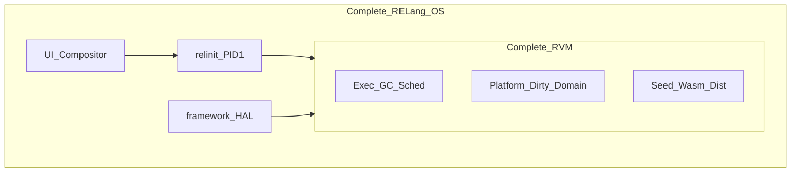
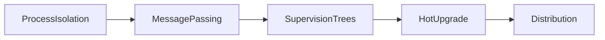
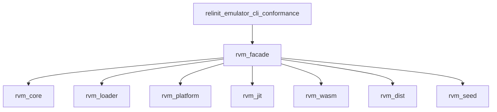
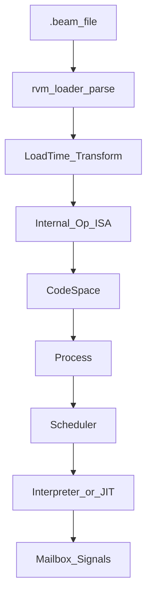
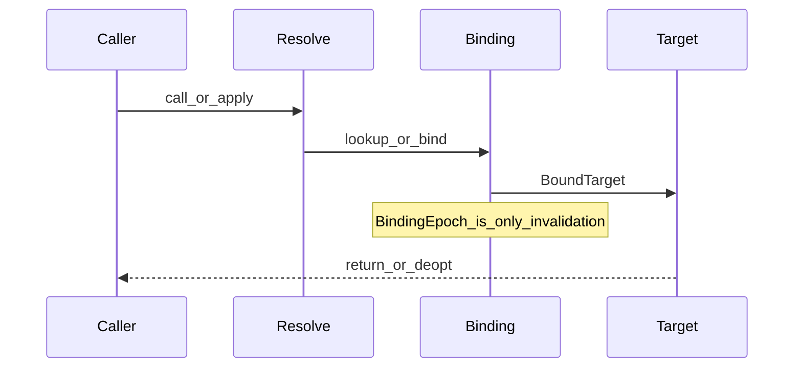
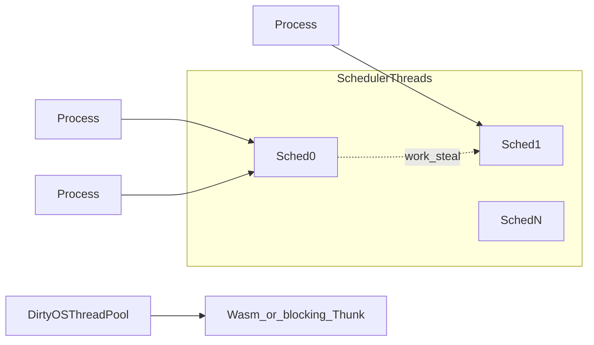
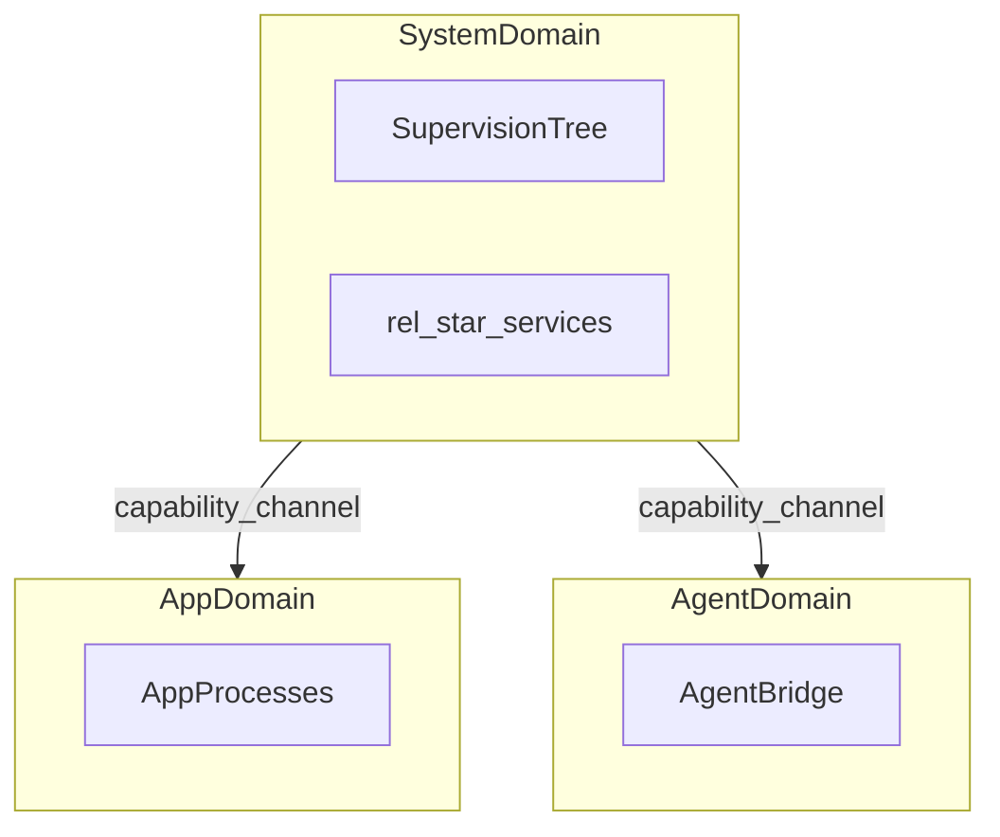
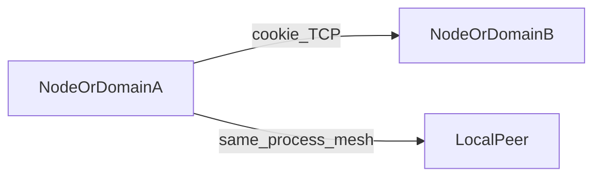
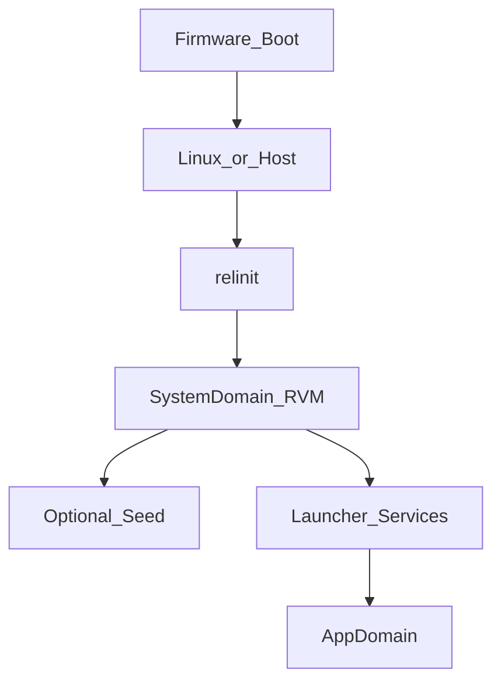

# 深入浅出：RVM —— RELang OS 的心脏

> **RVM**（RELang Virtual Machine）是用 Rust 实现的 Erlang/BEAM 应用运行时。  
> **RVM 之于 RELang，如同 ART 之于 Android。**

本文面向 OS / 运行时 / 系统工程师，以及想理解「为什么手机 OS 要以 BEAM 语义为心脏」的技术读者。读完你应能回答四件事：

1. RVM 与「又一个 OTP 发行版」差在哪里  
2. 一条 `.beam` 如何被加载、调度、JIT，并在 Domain 边界内运行  
3. Seed / Wasm / Dist 在 OS 叙事里各自扮演什么角色  
4. 「完整 RVM」已闭环什么，「完整 RELang OS」还缺什么（诚实账本）

完成度对齐内部架构状态账本（发版 **v0.3.0** 口径）。  
对外产品叙事只谈**可移植入口**；`io_uring` / `cgroup` / `unshare` 等是 Linux 实现细节，不假冒到其它 OS。

> **刊登说明**：本文介绍 RELang OS 的运行时心脏 **RVM**。RELang OS 为**专有软件**；本文刊登于公开宣传站，便于评估伙伴理解架构。完整源码与内部专篇需经评估授权获取。开放手机平台标准见 [MPS 长文](./mps-deep-dive.html)。

---

## 1. 先建立地图：运行时 ≠ 操作系统

很多人第一次听到 RVM，会把它当成「再做一个 Erlang」。更准确的切分是：

| 名称 | 包含 | 不包含 |
|------|------|--------|
| **完整 RVM** | 执行核 + BIF/能力面 + Platform I/O + Dirty 池 + Domain + Seed Zygote + Dist + Wasm WIT | 全量 OTP、ports、追踪 JIT、MFA IC |
| **完整 RELang OS** | 完整 RVM + `relinit` + framework/HAL + 合成器/UI + 系统服务 | 消费级生态冷启动策略另案 |

类比一张表：

| Android 世界 | RELang 世界 |
|--------------|-------------|
| ART | **RVM** |
| system_server | 系统监督树（`rel_*` 服务） |
| Zygote | **Seed** 预热镜像 + fork 孵化 |
| Binder（对照） | 域内消息 / 域间通道 |
| Kotlin | Gleam（主推应用语言） |
| NDK（对照） | **Wasm**（默认安全承载计算密集） |

RVM 不是「又一个通用语言 VM」，而是**面向操作系统的 BEAM 语义运行时**：把隔离进程、消息传递、监督树、热升级与分布式，从应用层的库，提升为系统第一性原则。

---

## 2. 为什么选 BEAM 做手机心脏？

手机 OS 要同时面对：后台任务、传感器、网络、AI 代理、多端协同，以及「局部故障不能拖垮整机」。BEAM 族已经用三十年验证过一套组合拳：

白话对应：

| 原则 | 对手机 OS 意味着什么 |
|------|----------------------|
| **隔离进程** | 一个服务崩了，默认不带走整个系统堆 |
| **消息传递** | 协作靠契约，而不是共享可变状态 |
| **监督树** | 故障有重启策略，而不是靠「重启整机碰运气」 |
| **热升级** | 关键路径可演进，不必永远冷启动 |
| **分布式** | 多端与多域天然是「消息世界」的一等公民 |

**非目标也要说清**：RVM **不追求 100% OTP**。没有 ambient `os:cmd` / ports；能力走显式授权；差异化走 Domain、Seed、可移植 Platform，而不是把通用 VM 峰值 KPI 伪装成产品完成度。

---

## 3. 一张依赖图：只许走门面 `rvm`

工程强制分层：嵌入方（`relinit`、模拟器、CLI、conformance）**只依赖门面 crate `rvm`**，禁止业务直接依赖 `rvm-core` / `rvm-loader` 等内部 crate。嵌入方只依赖门面 crate `rvm`（评估材料中的依赖分层规范）。

门面可选 feature：`jit` / `wasm` / `dist` / `seed`。  
需要 Linux 专有后端时再显式 `use rvm::linux::…`——默认叙事永远是可移植 API：`try_native_async_fs`、`try_isolate_domain`、`Zygote::fork_wait` 等。

---

## 4. 一条 `.beam` 的一生

从文件到正在跑的进程，可以看成一条流水线（设计见 **P0**）：

要点：

1. **加载**：解析 chunk，得到模块与函数表  
2. **变换**：加载期把 BEAM 指令变成内部 `Op`（解释器与 JIT **共消费同一套真源**）  
3. **入驻**：代码进 CodeSpace；创建进程时带上堆、邮箱、规约（reduction）额度  
4. **执行**：调度器挑选可运行进程；解释执行或进入 Blocks JIT / AOT  
5. **协作**：消息、链接、监视、异常在进程边界上流动  

这就是「兼容 `.beam` 生态入口，同时保留 OS 级改造空间」的关键：兼容发生在**文件与语义边界**，优化发生在**内部 ISA 与调度**。

---

## 5. 三层执行与 Call Binding

### 5.1 T0 / T1 / T2

| 层 | 形态 | 角色 |
|----|------|------|
| **T0** | 线程化解释器 | 永远正确的底座；未编译可回落 |
| **T1** | Blocks JIT（Cranelift） | 热路径加速；导出表可原子切换 |
| **T2** | AOT / NativeImage | 预编译；仍可回落解释器 |

行业定位（见 **P1.6**）不是「变成 JVM」，而是：

> OTP 诚实通用路径 + ART 式分层交付 + Cranelift 热路径 IR。

### 5.2 Call Binding：绑定是唯一真相

**P2.5 Call Binding** 把跨模块调用收成一条纪律：

- **绑定**是唯一真相  
- **解析**是唯一入口  
- **失效**只有 BindingEpoch（热升级 / 重载时整代作废，而不是到处打补丁）  

这让「可热更」与「可 JIT」能同时成立，而不靠 MFA 指令缓存这类脆弱捷径（明确不做 MFA IC）。

---

## 6. 调度与 GC：为什么 UI 不怕「全局停顿」

### 6.1 M:N 调度

- 每核调度线程、本地队列 + 工作窃取  
- **reduction** 抢占：长计算让出 CPU，保护交互与实时感  
- **Dirty 池**：真正阻塞 / 长 Wasm 可进 OS 线程，不堵调度器  

### 6.2 每进程分代 GC

RVM 采用**每进程**分代复制式 GC（Cheney 系），**没有**「停全世界」的共享堆全局 GC。major GC 还可在安全点切成时间片，降低单次停顿尖峰。

对手机 UI 与多服务共存，这比「一个大堆大家抢」更贴 OS 模型：故障与回收默认落在进程边界内。

---

## 7. Domain：语言隔离 vs 安全边界

关键一句（OS §7）：

> **域内** BEAM 进程是语言级隔离，**不是**安全边界；**域与域之间**才是。

含义：

- 同域内：轻量消息、OTP 式协作  
- 跨域：必须走能力与通道；不可伪造的句柄代替「Ambient 权限」  
- 隔离实现走**可移植** `try_isolate_domain`；Linux cgroup/ns 等是后端细节  

System Domain 由 `relinit` 拉起，挂载 framework 监督树；应用与 Agent 落在各自域——这才是「OS 心脏」而不只是「语言运行时」。

---

## 8. Seed、Wasm、Dist：OS 级外延

### 8.1 Seed ≈ Zygote

预热好的 VM 镜像 + Unix `fork`+CoW 孵化新实例，降低冷启动成本。  
Windows 无法把 warm image 交给新进程时，诚实返回 `Unsupported`——不拿假成功冒充跨平台 Zygote。

### 8.2 Wasm ≈ 安全 NDK

默认用 Wasm（`i32→i32` + 最小 WIT）承载计算密集扩展，而不是开放 ports / 任意本地代码。长计算可 Dirty 入队，避免堵死调度。

### 8.3 Dist：子集，且说清楚

同进程 mesh + 跨进程 TCP + cookie；与 OTP 的握手 / `REG_SEND` / `MONITOR_P` 等是**已验证子集**。  
**不是**「任意 `erl` 版本全协议互通」。完整 OTP Dist 矩阵仍在延后清单里——这是诚实，不是害羞。

---

## 9. 谁在上面跑？

| 层 | 角色 |
|----|------|
| **`relinit`** | PID 1：装载 System Domain，拉起监督树与能力下发 |
| **framework (`rel_*`)** | Erlang 系统服务；经 `rel_svc` 等路径与 RVM 原生能力协作 |
| **UI Engine / Compositor** | 界面与合成在 Rust 侧；业务状态仍可落在 BEAM 进程 |
| **sdk/emulator · relang-cli** | Host 日用闭环、preview、MCP（`relang mcp serve`） |
| **apps** | Gleam / Erlang 应用以 `.beam` / 包形式进入 RVM |

启动链（概念）：

RELang **不自研 Codex**：把 MCP / LSP / preview 当作外部 AI 工具的后端即可（Host 工作流见宣传仓说明与评估材料）。

---

## 10. 完成度诚实账本（R1–R9）

摘自 **P3**（勿把 Host 契约写成真机 Done）：

| # | 能力 | 状态 |
|---|------|------|
| R1 | 解释器 + Blocks JIT + AOT；未编译可回落 | **Done** |
| R2 | 里程碑 BIF/能力；无 ambient ports/`os:cmd` | **Done** |
| R3 | 可移植原生 AsyncIo（桌面三平台） | **Done** |
| R4 | Dirty OS 线程池 | **Done** |
| R5 | Seed Zygote（Unix fork；Windows `Unsupported`） | **Done**（含诚实失败） |
| R6 | 可移植 Domain 隔离 | **Done** |
| R7 | Dist：mesh + TCP + cookie（子集） | **Done** |
| R8 | Wasm：`i32→i32` + 最小 WIT | **Done** |
| R9 | host Power / Lifecycle | **Done** |

| 更大范围 | 状态 |
|----------|------|
| 完整 RELang OS（产品层 / 板级 HAL / EDK2 装入内存等） | **仍后续** |
| 模拟器日用切片 / Host MCP | **Done（Host/CI）** |
| 真媒体 / 电台 / mesh | **Partial（Host/CI 契约）** |

跨平台产品矩阵（叙事默认列）：

| 能力 | Linux | macOS | Windows |
|------|-------|-------|---------|
| 原生 AsyncIo | 有 | 有 | 有 |
| Domain 隔离 | 有 | 有 | 有 |
| Zygote 孵化 | fork+CoW | fork+CoW | `Unsupported` |
| 解释器 / JIT / Dist / Dirty / WIT | 有 | 有 | 有 |

**明确不做 / 仍延后（节选）**：全量 OTP；ports；MFA IC；追踪 JIT；非 Linux 假冒 io_uring/cgroup；完整 OTP Dist；整 VM CRaC/CRIU；OTel GUI。

下一刀优先 OS/UI/mesh 表面（如 UI S4+），**不以「多设备」为由继续加深 RVM 内核（D6 延后）**。

---

## 11. 工程纪律如何保住语义

RVM 能当 OS 心脏，靠的不只是功能列表，还有强制闭环：

- 工程规范 §8：主路径 + 失败路径 + 契约 + 测试 + 可运维  
- 源码与测试分离；禁止用指纹 Op 刷分（见性能基准诚实口径）  
- 差分与 conformance（如对 OTP 的诚实对照）优先于「感觉能跑」  
- 排查：**代码优先**，先串调用链再怪环境  

没有这些，BEAM 兼容会在「快一点」的诱惑下慢慢烂掉。

---

## 12. 结语

RVM 要回答的问题不是「能不能再实现一个虚拟机」，而是：

> 能否把 BEAM 验证过的并发与容错模型，做成**可移植、可隔离、可孵化、可观测**的手机 OS 运行时，并诚实标出与全量 OTP 的边界？

今天的答案是：**完整 RVM（R1–R9）已在桌面三平台产品口径上闭环**；完整 RELang OS 仍在产品与板级路径上推进。  
读懂这颗心脏，才读得懂上面的监督树、UI、Mesh 与 Agent 为什么长成现在这样。

---

## 延伸阅读

| 入口 | 内容 |
|------|------|
| [RELang OS 深入浅出](./relang-os-deep-dive.html) | 整机架构地图 |
| [MPS 深入浅出](./mps-deep-dive.html) | 开放手机平台标准 MPS |
| [申请评估](https://github.com/ShujianLv/RELangOS/issues/new?template=evaluation.yml) | 获取专有架构专篇与联调材料 |
| [RELang OS 官网](../index.html) | 产品叙事与合作入口 |
| [宣传仓 README](https://github.com/ShujianLv/RELangOS) | 中英简介 |
